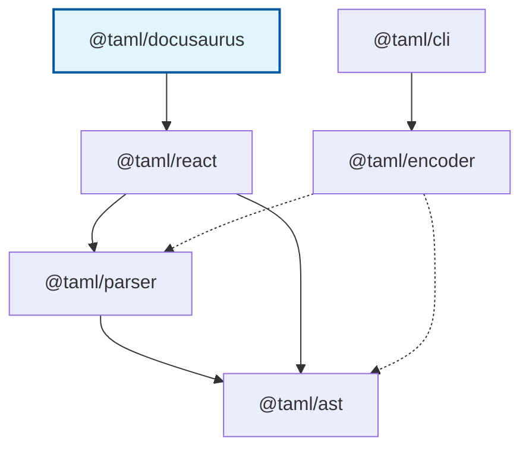

# @taml/docusaurus

> Docusaurus preset for rendering TAML (Terminal ANSI Markup Language) code blocks as styled components

[](https://www.npmjs.com/package/@taml/docusaurus)
[](https://www.npmjs.com/package/@taml/docusaurus)
[](https://www.typescriptlang.org/)
[](https://opensource.org/licenses/MIT)
[](https://github.com/suin/taml-docusaurus/actions/workflows/ci.yml)
[](https://github.com/suin/taml-docusaurus/actions/workflows/publish.yml)

## TAML Ecosystem

**TAML (Terminal ANSI Markup Language)** is a lightweight markup language for styling terminal output with ANSI escape codes. For the complete specification, visit the [TAML Specification Repository](https://github.com/suin/taml-spec).

### Package Dependencies



### Related Packages

#### Core Infrastructure

- **[@taml/ast](https://github.com/suin/taml-ast)** - Foundation package providing AST node types, visitor patterns, and tree traversal utilities for TAML documents.
- **[@taml/parser](https://github.com/suin/taml-parser)** - Robust parser that converts TAML markup strings into typed AST nodes with comprehensive error handling and validation.

#### Input/Output Tools

- **[@taml/encoder](https://github.com/suin/taml-encoder)** - Converts raw ANSI escape sequences into clean TAML markup for further processing and manipulation.
- **[@taml/cli](https://github.com/suin/taml-cli)** - Command-line tool for converting ANSI escape sequences to TAML format in batch operations.

#### Integration Packages

- **[@taml/react](https://github.com/suin/taml-react)** - React component that renders TAML markup as styled JSX elements with full TypeScript support and performance optimization.
- **[@taml/docusaurus](https://github.com/suin/taml-docusaurus)** - Docusaurus preset for rendering TAML (Terminal ANSI Markup Language) code blocks as styled components.

## Installation

### npm

```bash
npm install @taml/docusaurus
```

### yarn

```bash
yarn add @taml/docusaurus
```

### pnpm

```bash
pnpm add @taml/docusaurus
```

### bun

```bash
bun add @taml/docusaurus
```

### TypeScript Setup

This package includes TypeScript declarations out of the box. No additional setup is required for TypeScript projects.

```typescript
// ESM
import { preset } from "@taml/docusaurus";

// CommonJS
const { preset } = require("@taml/docusaurus");
```

## Quick Start

Here's a 5-minute introduction to adding TAML support to your Docusaurus site:

```javascript
// docusaurus.config.js
const config = {
  // ... other config
  presets: [
    ['classic', { /* classic preset options */ }],
    ['@taml/docusaurus'], // Add this line
  ],
  // ... rest of config
};

module.exports = config;
```

Now you can use TAML in your markdown files:

````markdown
# Terminal Output Examples

Here's a colorful terminal output:

```taml
<green>user@computer</green>:<blue>~/project</blue>$ npm test

<bold><blue>Running tests...</blue></bold>

<green>✓</green> All tests passed <dim>(15 tests, 2.3s)</dim>
<yellow>⚠</yellow> 1 snapshot updated
<red>✗</red> Coverage threshold not met
```

Log messages with different severity levels:

```taml
<dim>2024-12-07 10:30:15</dim> <blue>[INFO]</blue> Application started
<dim>2024-12-07 10:30:16</dim> <green>[SUCCESS]</green> Database connected  
<dim>2024-12-07 10:30:45</dim> <yellow>[WARN]</yellow> High memory usage
<dim>2024-12-07 10:31:02</dim> <red>[ERROR]</red> Connection failed
```
````

## Features

- 🎨 **Rich Terminal Styling**: Supports all 37 TAML tags (colors, backgrounds, text styles)
- 📝 **Markdown Integration**: Seamlessly renders TAML in Docusaurus markdown files
- ⚡ **Zero Configuration**: Works out of the box with Docusaurus classic preset
- 🔧 **TypeScript Ready**: Full type safety and IntelliSense support
- 🎯 **Automatic Processing**: Transforms ` ```taml ` code blocks automatically
- 📦 **Lightweight**: Minimal bundle size impact

## Usage Examples

### Basic Configuration

Add the preset to your `docusaurus.config.js`:

```javascript
// docusaurus.config.js
const config = {
  // ... other config
  presets: [
    ['classic', { /* classic preset options */ }],
    ['@taml/docusaurus'], // Add this line
  ],
  // ... rest of config
};

module.exports = config;
```

### Using TAML in Markdown

In your markdown files, use code blocks with `taml` language:

````markdown
# Terminal Output Examples

Here's a colorful terminal output:

```taml
<green>user@computer</green>:<blue>~/project</blue>$ npm test

<bold><blue>Running tests...</blue></bold>

<green>✓</green> All tests passed <dim>(15 tests, 2.3s)</dim>
<yellow>⚠</yellow> 1 snapshot updated
<red>✗</red> Coverage threshold not met
```
````

### Terminal Commands

````markdown
```taml
<green>$</green> <bold>git status</bold>
On branch main
Your branch is up to date with 'origin/main'.

<red>Changes not staged for commit:</red>
  <red>modified:</red>   <dim>src/components/Button.tsx</dim>
  <red>modified:</red>   <dim>docs/api.md</dim>

<yellow>Untracked files:</yellow>
  <dim>temp/</dim>
  <dim>.env.local</dim>
```
````

### Application Logs

````markdown
```taml
<bgGreen><black><bold> SUCCESS </bold></black></bgGreen> <green>Deployment completed</green>

<bold>Deployment Summary:</bold>
  <green>✓</green> Frontend build completed <dim>(2m 15s)</dim>
  <green>✓</green> Backend tests passed <dim>(45s)</dim>  
  <green>✓</green> Database migration successful <dim>(12s)</dim>
  <green>✓</green> Health checks passing <dim>(5s)</dim>

<bold>Live URLs:</bold>
  <blue><underline>https://app.example.com</underline></blue>
  <blue><underline>https://api.example.com</underline></blue>
```
````

### Error Messages

````markdown
```taml
<bgRed><white><bold> ERROR </bold></white></bgRed>

<red><bold>Build failed with 3 errors:</bold></red>

<bold>1. TypeScript Error</bold>
   <dim>src/utils/api.ts:42:15</dim>
   <red>Type 'string' is not assignable to type 'number'</red>

<bold>2. ESLint Error</bold>  
   <dim>src/components/Header.tsx:18:1</dim>
   <yellow>Missing return type annotation</yellow>

<bold>3. Test Failure</bold>
   <dim>tests/integration/auth.test.ts</dim>
   <red>Expected 200 but received 401</red>
```
````

## How It Works

The preset works by:

1. **Remark Plugin**: Transforms ` ```taml ` code blocks into JSX components
2. **Component Injection**: Automatically imports the `<Taml>` component
3. **React Rendering**: Uses `@taml/react` under the hood for consistent styling

### Processing Pipeline

```
Markdown → Remark Plugin → JSX Transformation → React Component → Styled Output
```

**Before processing:**
````markdown
```taml
<red>Error message</red>
```
````

**After processing (JSX):**
```jsx
import Taml from "@taml/docusaurus/component";

<Taml>{"<red>Error message</red>"}</Taml>
```

## Supported TAML Tags

### Colors (8 standard + 8 bright)
- **Standard**: `<red>`, `<green>`, `<blue>`, `<yellow>`, `<magenta>`, `<cyan>`, `<black>`, `<white>`
- **Bright**: `<brightRed>`, `<brightGreen>`, `<brightBlue>`, etc.

### Backgrounds (16 total)
- **Standard**: `<bgRed>`, `<bgGreen>`, `<bgBlue>`, etc.
- **Bright**: `<bgBrightRed>`, `<bgBrightGreen>`, etc.

### Text Styles (5 total)
- `<bold>`, `<dim>`, `<italic>`, `<underline>`, `<strikethrough>`

## Advanced Configuration

### Custom Setup

If you need more control, you can configure the preset:

```javascript
// docusaurus.config.js
const config = {
  presets: [
    ['classic', {
      docs: {
        // Classic preset docs config
      },
      blog: {
        // Classic preset blog config  
      },
    }],
    ['@taml/docusaurus'], // Automatically injects into docs, blog, and pages
  ],
};
```

### Manual Component Usage

You can also use the `<Taml>` component directly in MDX files:

```mdx
import Taml from '@taml/docusaurus/component';

# My Documentation

<Taml>{"<bold><blue>This is manually rendered TAML</blue></bold>"}</Taml>
```

## Styling

The preset includes default CSS styles for all TAML tags. The styles are automatically injected and use semantic class names:

- `.taml-outer` - Outer container
- `.taml-inner` - Inner `<pre>` element  
- `.taml-red`, `.taml-green`, etc. - Color classes
- `.taml-bold`, `.taml-italic`, etc. - Style classes

### Custom Styling

You can override the default styles in your Docusaurus CSS:

```css
/* Custom terminal styling */
.taml-outer {
  background: #1e1e1e;
  border-radius: 8px;
  padding: 1rem;
  margin: 1rem 0;
}

.taml-inner {
  background: transparent;
  color: #ffffff;
  font-family: 'Monaco', 'Menlo', monospace;
  font-size: 0.9rem;
  line-height: 1.4;
}

/* Override specific colors for dark theme */
.taml-red {
  color: #ff6b6b;
}

.taml-green {
  color: #51cf66;
}
```

## Integration with TAML Ecosystem

### With Parser and AST

```typescript
import { parse } from "@taml/parser";
import { visit, getAllText, getElementsWithTag } from "@taml/ast";

// Parse TAML markup into AST
const ast = parse("<red>Hello <bold>World</bold>!</red>");

// Process the AST
const text = getAllText(ast);
visit(ast, {
  visitElement: (node) => console.log(`Element: ${node.tagName}`),
});
```

### With Encoder

```typescript
import { encode } from "@taml/encoder";

// Convert ANSI to TAML for use in documentation
const ansiText = "\x1b[31mError:\x1b[0m Operation failed";
const tamlMarkup = encode(ansiText);
// Use tamlMarkup in your Docusaurus markdown files
```

### With CLI Tools

```bash
# Generate TAML examples for documentation
git status | taml > docs/examples/git-status.taml
npm test | taml > docs/examples/test-output.taml
docker build . | taml > docs/examples/docker-build.taml
```

### Complete Processing Pipeline

```typescript
import { encode } from "@taml/encoder";
import { parse } from "@taml/parser";
import { visit, getAllText, getElementsWithTag } from "@taml/ast";

// Complete ANSI → TAML → AST → Documentation pipeline
const ansiOutput = "\x1b[31mERROR:\x1b[0m \x1b[1mDatabase connection failed\x1b[0m";

// 1. Convert ANSI to TAML
const tamlMarkup = encode(ansiOutput);
console.log(tamlMarkup); // "<red>ERROR:</red> <bold>Database connection failed</bold>"

// 2. Parse TAML to AST
const ast = parse(tamlMarkup);

// 3. Analyze AST
const plainText = getAllText(ast);
const redElements = getElementsWithTag(ast, "red");
const boldElements = getElementsWithTag(ast, "bold");

console.log("Plain text:", plainText);
console.log("Red elements:", redElements.length);
console.log("Bold elements:", boldElements.length);

// 4. Use in Docusaurus documentation
// ```taml
// <red>ERROR:</red> <bold>Database connection failed</bold>
// ```
```

## API Reference

### Preset Configuration

The preset can be used with default settings or customized:

```javascript
// Default usage
['@taml/docusaurus']

// With options (future extensibility)
['@taml/docusaurus', {
  // Future configuration options
}]
```

### Component Export

The preset exports a `<Taml>` component for manual usage:

```typescript
import Taml from '@taml/docusaurus/component';

// Props interface
interface TamlProps {
  children: string;
  className?: string;
}
```

### Remark Plugin

The preset includes a remark plugin that processes TAML code blocks:

```typescript
// Plugin processes code blocks with:
// - language: "taml"
```

## Advanced Topics

### Performance Considerations

#### Efficient Processing

The preset is optimized for documentation sites:

- **Build-time Processing**: TAML is processed during build, not runtime
- **Component Reuse**: Single `<Taml>` component handles all rendering
- **CSS Optimization**: Minimal CSS footprint with semantic classes
- **Bundle Size**: Lightweight preset with minimal dependencies

#### Memory Usage

- **Static Generation**: No runtime parsing overhead
- **Shared Components**: Efficient component reuse across pages
- **CSS Classes**: Semantic class names for optimal CSS compression

### Error Handling Patterns

#### Graceful Degradation

```javascript
// The preset handles invalid TAML gracefully
// Invalid syntax falls back to plain text rendering
```

#### Development Warnings

```javascript
// During development, invalid TAML syntax will show warnings
// in the console to help with debugging
```

### Integration Patterns

#### Documentation Generation

```bash
# Generate documentation examples
mkdir docs/examples
git log --oneline --color=always | head -10 | taml > docs/examples/git-log.taml
npm test | taml > docs/examples/test-output.taml
docker build . | taml > docs/examples/docker-build.taml
```

#### Tutorial Creation

```markdown
# Create interactive tutorials with preserved colors
## Step 1: Initialize Git Repository

```taml
<green>$</green> git init
Initialized empty Git repository in /project/.git/
```

## Step 2: Add Files

```taml
<green>$</green> git add .
<green>$</green> git commit -m "Initial commit"
[main (root-commit) abc123] Initial commit
 3 files changed, 42 insertions(+)
```
```

#### API Documentation

```markdown
# Error Responses

When an API call fails, you'll receive an error response:

```taml
<red>HTTP/1.1 400 Bad Request</red>
<dim>Content-Type: application/json</dim>

{
  <red>"error"</red>: <yellow>"Invalid request"</yellow>,
  <red>"code"</red>: <yellow>"INVALID_INPUT"</yellow>
}
```
```

## Troubleshooting

### Code Blocks Not Transforming

Make sure you're using the correct syntax:

````markdown
<!-- ✅ Correct -->
```taml
<red>Error message</red>
```

<!-- ❌ Incorrect - wrong language -->
```html
<red>Error message</red>
```

<!-- ❌ Incorrect - old syntax (no longer supported) -->
```html taml
<red>Error message</red>
```
````

### TypeScript Errors

If you see TypeScript errors, ensure the preset is properly installed and the types are available:

```bash
npm install @taml/docusaurus --save-dev
```

### Styling Issues

If TAML content appears unstyled, check that:

1. The preset is correctly added to your `docusaurus.config.js`
2. You're using the `taml` code block syntax
3. The default CSS is loading (inspect element to verify classes)

### Build Errors

If you encounter build errors:

1. Ensure you're using a compatible Docusaurus version (3.0+)
2. Check that the preset is properly configured
3. Verify that your TAML syntax is valid

## Contributing

We welcome contributions! Please see our [Contributing Guide](CONTRIBUTING.md) for details.

### Development Setup

```bash
# Clone the repository
git clone https://github.com/suin/taml-docusaurus.git
cd taml-docusaurus

# Install dependencies
bun install

# Run tests
bun test

# Build the project
bun run build

# Lint and format
bun run lint
bun run format
```

### Testing

The project uses Bun for testing with comprehensive test coverage:

```bash
# Run all tests
bun test

# Run tests in watch mode
bun test --watch

# Run specific test file
bun test plugin.test.ts
```

### Code Quality

```bash
# Lint code
bun run lint

# Format code
bun run format

# Type checking
bun run build
```

## License

MIT © [suin](https://github.com/suin)

---

**Part of the TAML ecosystem** - Visit the [TAML Specification](https://github.com/suin/taml-spec) for more information about the Terminal ANSI Markup Language.