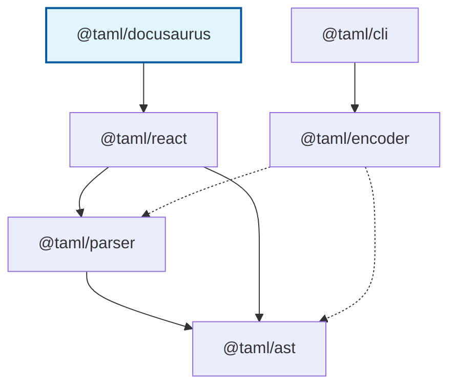

# @taml/docusaurus

> Docusaurus preset for rendering TAML (Terminal ANSI Markup Language) code blocks as styled components

[](https://www.npmjs.com/package/@taml/docusaurus)
[](https://www.npmjs.com/package/@taml/docusaurus)
[](https://www.typescriptlang.org/)
[](https://opensource.org/licenses/MIT)
[](https://github.com/suin/taml-docusaurus/actions/workflows/ci.yml)
[](https://github.com/suin/taml-docusaurus/actions/workflows/publish.yml)

## TAML Ecosystem

**TAML (Terminal ANSI Markup Language)** is a lightweight markup language for styling terminal output with ANSI escape codes. For the complete specification, visit the [TAML Specification Repository](https://github.com/suin/taml-spec).

### Package Dependencies



### Related Packages

#### Core Infrastructure

- **[@taml/ast](https://github.com/suin/taml-ast)** - Foundation package providing AST node types, visitor patterns, and tree traversal utilities for TAML documents.
- **[@taml/parser](https://github.com/suin/taml-parser)** - Robust parser that converts TAML markup strings into typed AST nodes with comprehensive error handling and validation.

#### Input/Output Tools

- **[@taml/encoder](https://github.com/suin/taml-encoder)** - Converts raw ANSI escape sequences into clean TAML markup for further processing and manipulation.
- **[@taml/cli](https://github.com/suin/taml-cli)** - Command-line tool for converting ANSI escape sequences to TAML format in batch operations.

#### Integration Packages

- **[@taml/react](https://github.com/suin/taml-react)** - React component that renders TAML markup as styled JSX elements with full TypeScript support and performance optimization.
- **[@taml/docusaurus](https://github.com/suin/taml-docusaurus)** - Docusaurus preset for rendering TAML (Terminal ANSI Markup Language) code blocks as styled components.

## Demo

- **Docusaurus v3**
  - **Repository**: [suin/taml-docusaurus-example-v3](https://github.com/suin/taml-docusaurus-example-v3)
  - **Demo site**: [taml-docusaurus-example-v3.vercel.app](https://taml-docusaurus-example-v3.vercel.app/)

- **Docusaurus v2**
  - **Repository**: [suin/taml-docusaurus-example-v2](https://github.com/suin/taml-docusaurus-example-v2)
  - **Demo site**: [taml-docusaurus-example-v2.vercel.app](https://taml-docusaurus-example-v2.vercel.app/)

## Installation

### npm

```bash
npm install @taml/docusaurus
```

### yarn

```bash
yarn add @taml/docusaurus
```

### pnpm

```bash
pnpm add @taml/docusaurus
```

### bun

```bash
bun add @taml/docusaurus
```

## Configuration

Add the preset to your `docusaurus.config.js`.

### Docusaurus v3 (Recommended)

```javascript
// docusaurus.config.js
const config = {
  // ... other config
  presets: [
    ['classic', { /* classic preset options */ }],
    ['@taml/docusaurus', {}], // Add this line
  ],
  // ... rest of config
};

module.exports = config;
```

### Docusaurus v2

For Docusaurus v2, you need to specify the version option.

```javascript
// docusaurus.config.js
const config = {
  // ... other config
  presets: [
    ['classic', { /* classic preset options */ }],
    ['@taml/docusaurus', { docusaurusVersion: "v2" }], // Add this line
  ],
  // ... rest of config
};
```

#### Webpack Workaround for v2

Docusaurus v2 uses React 17. In some build environments, Webpack can fail with "fully specified" ESM resolution for `react/jsx-runtime`. If you hit that, add this workaround plugin:

```javascript
// docusaurus.config.js
const config = {
  // ... presets config ...

  // Workaround for Webpack "fully specified" ESM resolution failures on some build environments
  // (e.g. when ESM dependencies import `react/jsx-runtime` without the `.js` extension).
  plugins: [
    function webpackResolveReactJsxRuntime() {
      return {
        name: 'webpack-resolve-react-jsx-runtime',
        configureWebpack() {
          return {
            resolve: {
              alias: {
                'react/jsx-runtime': require.resolve('react/jsx-runtime'),
                'react/jsx-dev-runtime': require.resolve('react/jsx-dev-runtime'),
              },
            },
          };
        },
      };
    },
  ],
  // ... rest of config
};
```

## Usage

In your markdown files, use code blocks with `taml` language.

### Basic Example

````markdown
# Terminal Output Examples

Here's a colorful terminal output:

```taml
<green>user@computer</green>:<blue>~/project</blue>$ npm test

<bold><blue>Running tests...</blue></bold>

<green>✓</green> All tests passed <dim>(15 tests, 2.3s)</dim>
<yellow>⚠</yellow> 1 snapshot updated
<red>✗</red> Coverage threshold not met
```
````

### More Examples

#### Terminal Commands

````markdown
```taml
<green>$</green> <bold>git status</bold>
On branch main
Your branch is up to date with 'origin/main'.

<red>Changes not staged for commit:</red>
  <red>modified:</red>   <dim>src/components/Button.tsx</dim>
  <red>modified:</red>   <dim>docs/api.md</dim>

<yellow>Untracked files:</yellow>
  <dim>temp/</dim>
  <dim>.env.local</dim>
```
````

#### Application Logs

````markdown
```taml
<bgGreen><black><bold> SUCCESS </bold></black></bgGreen> <green>Deployment completed</green>

<bold>Deployment Summary:</bold>
  <green>✓</green> Frontend build completed <dim>(2m 15s)</dim>
  <green>✓</green> Backend tests passed <dim>(45s)</dim>  
  <green>✓</green> Database migration successful <dim>(12s)</dim>
  <green>✓</green> Health checks passing <dim>(5s)</dim>

<bold>Live URLs:</bold>
  <blue><underline>https://app.example.com</underline></blue>
  <blue><underline>https://api.example.com</underline></blue>
```
````

#### Error Messages

````markdown
```taml
<bgRed><white><bold> ERROR </bold></white></bgRed>

<red><bold>Build failed with 3 errors:</bold></red>

<bold>1. TypeScript Error</bold>
   <dim>src/utils/api.ts:42:15</dim>
   <red>Type 'string' is not assignable to type 'number'</red>

<bold>2. ESLint Error</bold>  
   <dim>src/components/Header.tsx:18:1</dim>
   <yellow>Missing return type annotation</yellow>

<bold>3. Test Failure</bold>
   <dim>tests/integration/auth.test.ts</dim>
   <red>Expected 200 but received 401</red>
```
````

## Features

- 🎨 **Rich Terminal Styling**: Supports all 37 TAML tags (colors, backgrounds, text styles)
- 📝 **Markdown Integration**: Seamlessly renders TAML in Docusaurus markdown files
- ⚡ **Zero Configuration**: Works out of the box with Docusaurus classic preset
- 🔧 **TypeScript Ready**: Full type safety and IntelliSense support
- 🎯 **Automatic Processing**: Transforms ` ```taml ` code blocks automatically
- 📦 **Lightweight**: Minimal bundle size impact

## How It Works

The preset works by:

1. **Remark Plugin**: Transforms ` ```taml ` code blocks into JSX components
2. **Component Injection**: Automatically imports the `<Taml>` component
3. **React Rendering**: Uses `@taml/react` under the hood for consistent styling

### Processing Pipeline

```
Markdown → Remark Plugin → JSX Transformation → React Component → Styled Output
```

**Before processing:**
````markdown
```taml
<red>Error message</red>
```
````

**After processing (JSX):**
```jsx
import Taml from "@taml/docusaurus/component";

<Taml>{"<red>Error message</red>"}</Taml>
```

## Supported TAML Tags

### Colors (8 standard + 8 bright)
- **Standard**: `<red>`, `<green>`, `<blue>`, `<yellow>`, `<magenta>`, `<cyan>`, `<black>`, `<white>`
- **Bright**: `<brightRed>`, `<brightGreen>`, `<brightBlue>`, etc.

### Backgrounds (16 total)
- **Standard**: `<bgRed>`, `<bgGreen>`, `<bgBlue>`, etc.
- **Bright**: `<bgBrightRed>`, `<bgBrightGreen>`, etc.

### Text Styles (5 total)
- `<bold>`, `<dim>`, `<italic>`, `<underline>`, `<strikethrough>`

## Styling

The preset includes default CSS styles for all TAML tags. The styles are automatically injected and use semantic class names:

- `.taml-outer` - Outer container
- `.taml-inner` - Inner `<pre>` element  
- `.taml-red`, `.taml-green`, etc. - Color classes
- `.taml-bold`, `.taml-italic`, etc. - Style classes

### Custom Styling

You can override the default styles in your Docusaurus CSS:

```css
/* Custom terminal styling */
.taml-outer {
  background: #1e1e1e;
  border-radius: 8px;
  padding: 1rem;
  margin: 1rem 0;
}

.taml-inner {
  background: transparent;
  color: #ffffff;
  font-family: 'Monaco', 'Menlo', monospace;
  font-size: 0.9rem;
  line-height: 1.4;
}

/* Override specific colors for dark theme */
.taml-red {
  color: #ff6b6b;
}

.taml-green {
  color: #51cf66;
}
```

## Advanced Usage

### Manual Component Usage

You can also use the `<Taml>` component directly in MDX files:

```mdx
import Taml from '@taml/docusaurus/component';

# My Documentation

<Taml>{"<bold><blue>This is manually rendered TAML</blue></bold>"}</Taml>
```

### Integration with TAML Ecosystem

You can use other TAML packages to generate content for your documentation.

```bash
# Generate TAML examples for documentation using @taml/cli
git status | taml > docs/examples/git-status.taml
npm test | taml > docs/examples/test-output.taml
```

For more complex pipelines (ANSI → TAML → AST), see the [TAML Ecosystem](#taml-ecosystem) packages.

## API Reference

### Component Export

The preset exports a `<Taml>` component for manual usage:

```typescript
import Taml from '@taml/docusaurus/component';

// Props interface
interface TamlProps {
  children: string;
  className?: string;
}
```

### Remark Plugin

The preset includes a remark plugin that processes TAML code blocks:

```typescript
// Plugin processes code blocks with:
// - language: "taml"
```

## Troubleshooting

### Code Blocks Not Transforming

Make sure you're using the correct syntax:

````markdown
<!-- ✅ Correct -->
```taml
<red>Error message</red>
```

<!-- ❌ Incorrect - wrong language -->
```html
<red>Error message</red>
```
````

### Build Errors

If you encounter build errors:

1. Ensure you're using a compatible Docusaurus version (v2 or v3).
2. For Docusaurus v2, ensure `docusaurusVersion: "v2"` is set in config.
3. If using v2 and encountering Webpack errors, apply the [Webpack Workaround](#webpack-workaround-for-v2).

## Contributing

We welcome contributions! Please see our [Contributing Guide](CONTRIBUTING.md) for details.

### Development Setup

```bash
git clone https://github.com/suin/taml-docusaurus.git
cd taml-docusaurus
bun install
bun run build
bun test
```

## License

MIT © [suin](https://github.com/suin)

---

**Part of the TAML ecosystem** - Visit the [TAML Specification](https://github.com/suin/taml-spec) for more information about the Terminal ANSI Markup Language.
